# README

# “Spotify Buddies”: an organic playlist recommender

---

## Overview

- We’ll design a machine learning system for organic playlist recommendations to be integrated in music streaming services, specifically Spotify.
- The main feature of the model is that it will recommend ‘organic’ playlists to the user, meaning a playlist that was created by a human user with similar music taste to the requesting user, as opposed to an algorithmically-generated synthetic playlist.

## Value Proposition

- We strongly believe that music streaming services are missing a huge opportunity in no leveraging a social dimension in their products.
- Organic playlists recommendations is one way to incorporate such social aspect, encouraging users to engage with the playlists from other users, and sharing their music taste with each other.
- This might improve business metrics related to user engagement, such as screen time, hours of music play, size of user music library, and general retention of paid-subscription members.

### Contributors

| Name | Responsible for | Link to their commits in this repo |
| --- | --- | --- |
| All team members | Idea, value proposition, basic setup of ML problem |  |
| Agustin Leon | Model training, experiment tracking (Units 4 & 5)  | [Link](https://github.com/AguLeon/MLOps_G47_SpotifyBuddies/commits/main?author=AguLeon) |
| Akhil Manoj | Data pipeline (unit 8) | [Link](https://github.com/AguLeon/MLOps_G47_SpotifyBuddies/commits/main?author=AkM-2018)  |
| Anup Raj Niroula | Model serving and monitoring (Units 6 & 7) | [Link](https://github.com/AguLeon/MLOps_G47_SpotifyBuddies/commits/main?author=ARNiroula) |
| Jishnu Warrier | Continuous pipeline (unit 3) | [Link](https://github.com/AguLeon/MLOps_G47_SpotifyBuddies/commits/main?author=jishnuwarrier) |

### System diagram

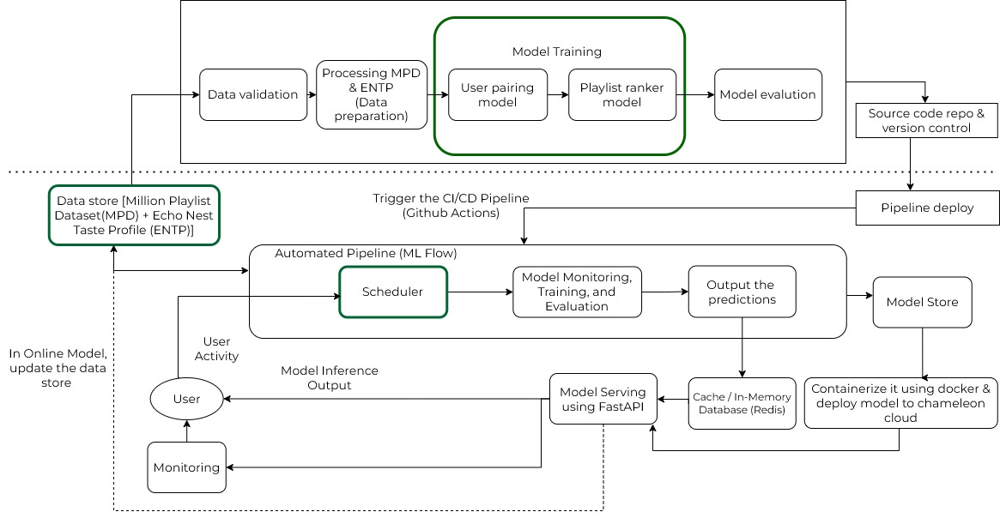

### Summary of outside materials

|  | How it was created | Conditions of use |
| --- | --- | --- |
| Million Playlist Dataset | Created by Spotify for the RecSys Challenge 2018 | Available for research open-ended use |
| EchoNest Taste Profile Subset | Created by LabROSA @ Columbia University, currently maintained by Spotify | Available for open-ended use |

### Summary of infrastructure requirements

| Requirement | How many/when | Justification |
| --- | --- | --- |
| `m1.medium` VMs | 4 for entire project duration | Hosts dashboard, model API, ML Flow |
| NVIDIA `gpu_A100` | 4 hour block 2-3 times a week | Required for training tasks |
| Floating IPs | 1 for entire project duration, 1 for sporadic use | Required for endpoints using FastAPI |
| Persistent volume | 100 GB | Storage for datasets, model artifacts, logs, batched inferences |

### Summary of extra difficulty points that we’ll aim for

| Unit | Topic | Difficulty point | Status |
| --- | --- | --- | --- |
| 1 | ML Ops Intro Unit | Using multiple models (we’ll be using two models) | Completed |
| 5 | Model training infrastructure and platform | Ray Tune | Completed |
| 6 | Model serving and monitoring | Develop multiple options for serving | Semi-completed |
| 7 | Evaluation and monitoring  | Monitor for model degradation | Completed |
| 8 | Data Pipeline | Interactive Data Dashboard | Completed |

# Detailed design plan

# Model Training & Infrastructure (Agustin)

## General overview

This pipeline uses two models, a K-Nearest Neighbors model (KNN) for pairing users and a Bayesian Personalized Ranking Model for ranking playlists (BPR).

The pipeline is the following:

1.  A user_id requests recommendations
2. We find itsneighbors based on the pre-computed KNN model pairings
3. We get the list of playlists that belong to their neighbors
4. We sample those playlists (also pre-computed and fixed)
5. We pass the user_id and the list of playlists onto the trained BPR model
6. We get the top_K ranked playlists as a recommendation (we use top_K = 5)

In a real pipeline computing pairings (running the KNN model) would happen much less frequently than re-training the BPR model.

The KNN Model takes about 2 hours to produce pairings.

The BPR Model training time depends a lot on some parameters, but it broadly takes 1hr30mins for 5 epochs.

For the BPR Model we trained implementing MLFlow and Ray Tune.

We will cover these models in detail below, in addition to the training process for both of them.

---

---

## 1) KNN Model Description and ‘Training’

- Relevant file:

[KNN_script](training/spotifybuddies_userpairingmodel_v0.py)

- The KNN Model calculates neighbors using cosine similarity among the vector of liked songs that each user has (this comes from the ENTP dataset).
- Benefits of KNN are its simplicity and interpretability, and it’s a good baseline model for getting pairings.
- Before running the KNN model we first need to answer a few questions and make some decisions:
    1. How many neighbors per user?
    2. Do we enforce a minimum and/or a max?
- For this, we choose to decide not only based on the amount of neighbors, but also, on the amount of playlists that the given user has access to, through its neighbors.
- We ask the KNN model to find neighbors at least until the user has at least 20 playlists owned by its neighbors (users that are very unique will have to be paired to more disimilar users to match this requirement). We also set the max of user neighbors at 50.
- Below we can see some statistics and metrics. On average each user gets 37 neighbors, median is 39 neighbors. Min and max are 1 and 100 respectively. Users that have 1 neighbor might have reached the 100 playlists requirement with just one neighbor.
- 

<aside>
📊

 Neighbor Count Statistics:

- Users analyzed : 101,713
- Min neighbors : 0
- Max neighbors : 50
- Mean neighbors : 36.79
- Median neighbors : 39.0
- 25th percentile : 30.0
- 75th percentile : 48.0
- 99th percentile : 50.0
</aside>


- We also explore ‘user popularity’. We exclude users that were never selected as a neighbor. The median is 57, and on average each user is the neighbor of 94 other users. Some users are extremely popular, with over 600 selections.

<aside>
📊


User Popularity (Times a User Was Paired as Neighbor):

- Users selected as neighbor: 39,634
- Min times selected : 1
- Max times selected : 2348
- Mean : 94.41
- Median : 57.0
- 90th percentile : 207.0
- 99th percentile : 609.0
</aside>

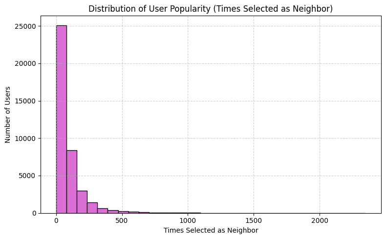

- Finally we check the playlist availability through neighbors. We can see a pretty soft shape, median is 222 playlists. Note that some users will have access to over 400 playlists. This could delay inference for that user. We take care of that next.

<aside>
📊

Playlists Accessible via Neighbors:

- Users analyzed : 101,713
- Min playlists : 0
- Max playlists : 1248
- Mean playlists : 266.27
- Median playlists : 221.0
- 25th percentile : 122.0
- 75th percentile : 372.0
- 99th percentile : 841.0
</aside>


### Final step: create dictionary that quickly maps user_id to a list of playlist id’s belonging to its neighbors. This is used for inference.

- For each user, we collect all the playlists owned by its neighbors.
- Since sometimes we get over 400 playlists for a user, we want to standardize this and get a similar amount of playlists for every user.
- We will sample randomly 75 users for each user (if they have less than 75 we will just take whatever much they have).
- In production the KNN would be recomputed with some frequency and we would sample different playlists each time. This could give the model some ‘freshness’, in which users don’t always get recommendations from the same set of playlists.

---

---

## 2) BPR Model Description and Training

- We decided to implement a Bayesian Personalized Ranking model (BRP) for our pipeline because of its effectiveness and simplicity. It also trains reasonably fast and it’s lightweight, so it’s suited for our timeline. A full model checkpoint of this model weighs about 1GB.

This model learns user and playlist embeddings, that will capture both user’s similarity and playlist’s similarity. The model is trained on triplets (user_id, positive_playlist_id, negative_playlist_id), where each triplet reveals a relative preference for a user for one playlist over some other playlist.

- Negative playlists aren’t necessarily disliked. The positive was just preferred over the negative playlist. A negative playlist might perfectly become a positive if it’s recommended among another set of playlists.

### Model Structure

- We will have both user embeddings and playlist embeddings. Our final embeddings have a dimension of 128.
- BPR will compute a dot product between the embeddings, this is the score:

$$
\text{score}_{u,i} = \boldsymbol{u}^\top \cdot \boldsymbol{i}, \quad \text{score}_{u,j} = \boldsymbol{u}^\top \cdot \boldsymbol{j}
$$


- u: embedding vector for user uuu
- i: embedding vector for positive playlist iii
- j: embedding vector for negative playlist jjj
- score(u,i): predicted preference score of user uuu for playlist iii

- The loss function is given by:

$$
\mathcal{L}*{\text{BPR}} = -\frac{1}{N} \sum*{(u,i,j)} \log \left( \sigma(\text{score}*{u,i} - \text{score}*{u,j}) \right)
$$

Where:

- sigma is the sigmoid function.
- (u,i,j) are user, positive playlist, and negative playlist triplets.

### Model Evaluation

For each validation positive sample:

- The model ranks 1 positive playlist among 50 negatives.
- We compute:
    - **MRR (Mean Reciprocal Rank)**: Average inverse rank of the true positive.
    - **Hit@K**: Measures if the true positive is in the top K results.

### Data Leakage?

- We took measures to protect the implementation from data leakage, as explained in the data preprocessing.
- The main precaution is that the model is evaluated with unseen playlists by the user. This replicates the “past vs future” nature of recommender systems. The model was trained on the “past”, and we know whether the user liked or not the users we recommended. In the future (evaluation) we won’t offer those playlists he already expressed a preference for. This is how recommender works: once you get a playlist and you add it to your collection, you should not get it as a recommendation again.

### Final parameters:

| **Parameter** | **Value** | **Description** |
| --- | --- | --- |
| `embedding_dim` | 128 | Size of user and playlist embedding vectors |
| `batch_size` | 16,384 | Number of triplets per training batch |
| `learning_rate` | 0.005 | Step size for the optimizer |
| `epochs` | 5 | Number of training epochs |
| `NUM_NEGATIVES` | 4 | Number of negative playlists sampled per positive in each training triplet |

---

---

## 3) BPR Model Training Jobs with MLFlow and Ray Tune

[BPR_script](training/spotifyBuddies_train_mlflow_v3.py)

- For training the BPR Model we implemented a training script that incorprated MLFlow and Ray Tune. We have two main runs: one with MLFlow only, and then another using Ray Tune.

### MLFlow Implementation:

- Below some code snippets from the training script that take care of setting MLFlow
- We used tags such as ‘full’ and ‘toy’, depending on which dataset was being used. Also we grouped jobs in different experiments.

```bash
MLFLOW_EXPERIMENT_NAME = 'SpotifyBuddies_experiment5_RayTune'
MLFLOW_TAGS = {
    "platform": "chameleon_cloud",
    "mode": "full",
    "run_type": "baseline"
}
```

- We directly put the tracking URI to our KVM@@TACC node hosting MLFlow and MinIO

```bash
mlflow.set_tracking_uri("http://129.114.27.215:8000")
mlflow.set_experiment(MLFLOW_EXPERIMENT_NAME)
mlflow.start_run()
mlflow.log_params(config)
mlflow.set_tags(MLFLOW_TAGS)
```

- We are sending to our MLFlow our custom metrics: MRR and Hit@K

```bash
mlflow.log_metrics({
    "train_loss": avg_train_loss,
    "val_mrr": val_mrr,
    **{f"hit-{k}": val_hit_rates[k] for k in val_hit_rates}
}, step=epoch)
```

- Finally we log into ML Flow our artifacts:

```bash
mlflow.pytorch.log_model(model, artifact_path="final_model")
mlflow.log_artifact("last_run_id.txt")
mlflow.log_artifact("training_config.json")
mlflow.log_artifact(MODEL_CONFIG_PATH)
mlflow.log_artifacts(checkpoint_bundle_dir, artifact_path="checkpoints")
```

### Ray Tune Implementation

- Ray Tune is used to **automate hyperparameter tuning** by launching multiple trials in parallel, each with a different configuration. It works together with MLflow to track results.
- We set yo the following exploring space:

```bash
RAY_SEARCH_SPACE = {
    "embedding_dim": tune.choice([64, 128]),
    "learning_rate": tune.loguniform(1e-4, 1e-2),
    "batch_size": tune.choice([8192, 16384]),
    "val_batch_dir": VAL_EVAL_BATCH_DIR,
    "triplet_path": TRIPLET_DATASET_PATH
}
```

- Then we put the config inside the training function:

```bash
report(metrics={
    "train_loss": avg_train_loss,
    "val_mrr": val_mrr,
    **{f"hit@{k}": val_hit_rates[k] for k in val_hit_rates}
})
```

- And we launch Ray Tune using:

```bash
tune.run(
    train_with_resources,
    config=RAY_SEARCH_SPACE,
    metric="val_mrr",
    mode="max",
    num_samples=RAY_NUM_SAMPLES,
    name="bpr_hpo",
    storage_path="~/ray_results",
    resume="AUTO"
)
```

- We only did one Ray Tune run on the full dataset, that created four experiments on MLFlow.

---

---

## 4) Main Results

- Our main run achieved on the validation set a MRR of 0.503 and the following Hit@K values:
    - Hit@1 = 0.33
    - Hit@5 = 0.72
    - Hit@10 = 0.90

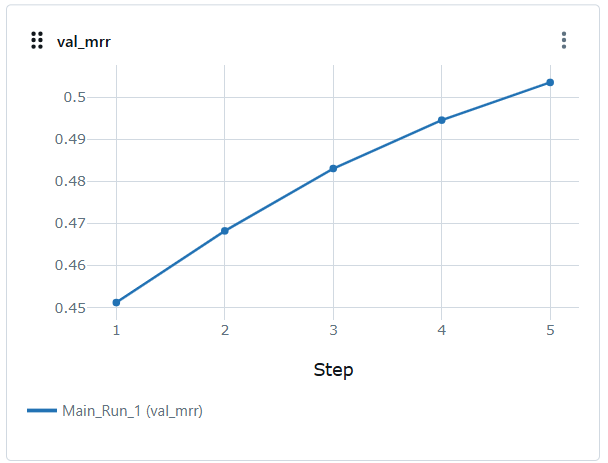

- Hit@5 is a very important metric because our model serving service will recommend 5 playlists to users. We can see that in 72% of cases a positive playlist existing in a bag with 50 negative playlists, will be ranked inside the top 5 playlists.


### Ray Tune results

- With respect to Ray Tune, we are including below a comparison of the experiments that Ray Tune handled. Since we ran Ray Tune just one time on the full dataset, we were able to explore only variations on the learning rate.

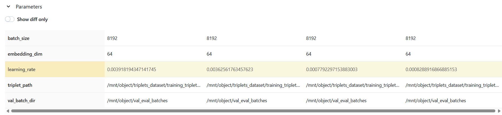

- We can see that Ray Tune identified some space for improvement, but it was very minor. Probably we need to experiment further in order to discover more significant improvements. Basically we tried too little of variations of learning rates, that allowed to increase MRR from 0.47889 to 0.47912, which is basically negligible.

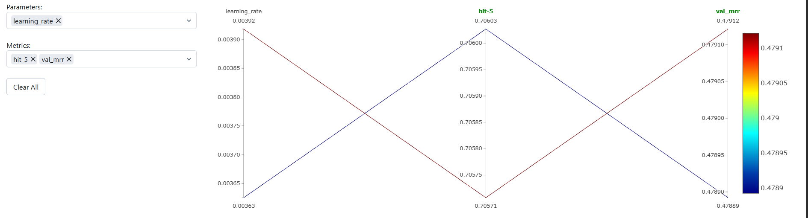

- Probably it would have been more interesting to explore another hyperparameter, such as embedding dimensions of the BPR Model, but still Ray Tune proved to be a valuable tool at exploring hyperspace optimization in a consistent way.

# Model Serving

## Serving from an API Endpoint

- We setup the API using [FastAPI](https://fastapi.tiangolo.com/). Reasons for choosing FastAPI for our Model Server
    - Ease to setup endpoints relatively fast for rapid prototyping and great developer experience
    - Our Model Server doesn’t just have Model Prediction task, it has I/O bound tasks (read/write to Redis). So, we choose FastAPI to leverage it’s native async capabilities
    - Bias and familiarity with using FastAPI
- The request body of our API endpoint is simply a list of `user_id` . Our output consists of map of `users_id`  mapped to the list of top-n recommended `playlist_id` for them.
    - Our API response output is strictly for testing and logging the predictions. We don’t serve the Predictions directly to the users from our Server!

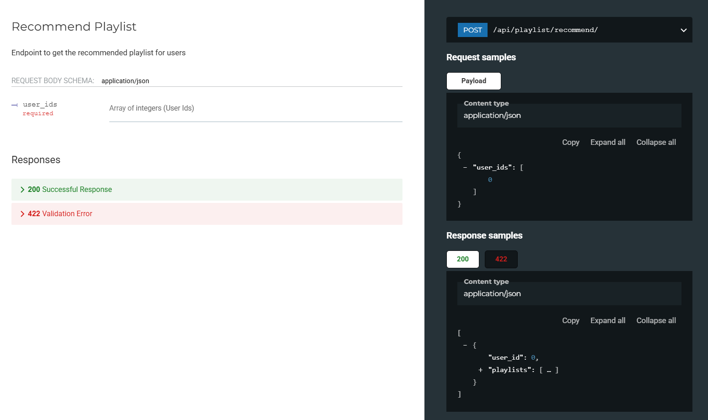

## Identify Requirements

Our specific customer is Spotify. Based on our customer, we did a requirement analysis and identified:

- Have recommended playlists daily for daily users.
    - We can run the recommendation every day in scheduled batches rather than doing real-time inference
- Have the inference be done in an interval rather than real-time (based on existing features such as “Discover Weekly” and “Release Radar”)
- User should be able to get the recommended playlists with minimal latency
    - Note ⇒ Even though they should get the playlists with minimal latency, we don’t necessarily need to make the inference in real time.
- Have a method to get user feedback on the given recommendation

## Model Optimizations

- We tried to mimic the flow of how Spotify performs does personalized playlists recommendation.
- Our System comprises of 2 models, the User Pairing Model and the Playlist Ranking Model
- We actually have the User Pairing Model done in a “offline” environment and it isn’t done during the actual “online” inference. The Server simply fetches the data the output from User Pairing Model
    - The output from User Pairing is further processed during the “offline” environment; the User Pairing already maps the users to their neighbors’ playlist which is then used by the Model Server for inference
    - In a system like Spotify, this Pairing is stored and fetched through some sort of [vector database](https://lynkz.com.au/blog/2024-vector-databases) to represent the users’ preferences. For our demonstration, we are loading the user pairing directly to our server during startup and are using function to simulate the fetching of pairing from the database. We can find this done in`model_server/ml_models/model.py`

## System Optimization

- Docker Image
    - We focused on minimizing the docker image size and speeding up image build up time
        - To achieve this, we utilized [uv](https://docs.astral.sh/uv/) as the package manager to leverage its faster build installation time.
            - Implementing the uv package reduced our docker build for the Inference Server from around 300 seconds to 30 seconds in the KVM `m1.large` instance
        - We also utilized Multi-Stage Dockerfile to optimize Docker Images and mimic a Production Ready Docker Image Build. This can be seen the [Dockerfile](https://github.com/AguLeon/MLOps_G47_SpotifyBuddies/blob/main/model_server/Dockerfile).
            - We `bookworm-slim` as base image to optimize our Docker containers
        - For our first iteration, we tried utilizing Nvidia’s CUDA for our Inference Model. But, it caused more issues with minimal gain.
            - Issues:
                - Our image build time increased upward to 200s
                - Our image size was more than 6GB.
                - Minimal gain in performance:
                    - Our inference model has a embedding dimension of 128
                    - We are doing inference in batches of 1000 users
                    - Our use case doesn’t require real-time predictions (since our inference will be done in a schedule of once a day)
                - The performance benefit of using GPU did not justify the cost in size and complexity of the build
            - To optimize deployment
                - We switched to use `pytorch-cpu`  to run the model in the Inference server.
                - Although the model was originally trained on GPU, it is now served on CPU, which meets our latency and throughput requirements
            - Results:
                - Image Size went from 6 GB to around 2 GB
                - Build time decreased back to around 30 second
                - We didn’t need CUDA drivers or CPU support for production
            - Our `pyproject.toml` description for the model inference. [Link](https://github.com/AguLeon/MLOps_G47_SpotifyBuddies/blob/main/model_server/pyproject.toml)
    - PS: We are running Python 3.12 rather than Python 3.13 due to compatibility issues with libraries used by for machine learning libraries
        - Due to this, we couldn’t leverage disabling the GIL for non-blocking operations
- Making Inference Logic and IO logic non-blocking
    - Our Inference Server has 2 main jobs:
        - Prediction/Inference using the ML Model
        - I/O to the database (in our case; Redis)
    - Since ML Model is an expensive and blocking task, during high number of request calls to the inference, it would dominate the FastAPI event loop. So, we opted to run this in its own separate process with max worker of 1 to reduce IPC
    - Doing this, we effectively made the model prediction task into a non-blocking task. Through this, we can leverage the async nature of FastAPI.
        - The implementation can be seen in
            - def [intialize_model](https://github.com/AguLeon/MLOps_G47_SpotifyBuddies/blob/main/model_server/ml_model/model.py)
            - def [recommend_playlist](https://github.com/AguLeon/MLOps_G47_SpotifyBuddies/blob/main/model_server/ml_model/recommender.py)
            - [API endpoint in action](https://github.com/AguLeon/MLOps_G47_SpotifyBuddies/blob/main/model_server/routers/playlist.py)
        - NOTE ⇒ We also have a implementation that uses RabbitMQ as message broker to send the prediction jobs to workers, all of whom then send the prediction directly to Redis. But, due to time constraint, this hasn’t been tested thoroughly.
            - The implementation can be seen in
                - `./model_server/services/rabbitmq.py`
                - `./model_server/services/rabbitmq_worker.py`
                - `./model_server/routes/playlist.py`  in the `beta_recommend` route
- Batch Input
    - For recommendation systems that are run in a schedule, the inference is done in batches of input. So, we opted to use that
        - Through our offline experiments, we found out that our model could run batches of 1000 ([experiment link](https://github.com/AguLeon/MLOps_G47_SpotifyBuddies/blob/main/training/sb_inference_model_v2.py)) inputs with significant improvement when compared to sequential predictions.
        - So, to enable that, we modified the prediction function to accommodate batch inference based on the above experiment
            - Implementation [Recommender().predict()](https://github.com/AguLeon/MLOps_G47_SpotifyBuddies/blob/main/model_server/ml_model/model.py)

## Business Specific Evaluation
- Business Specific Evaluation would be the increase in the Click Through Rate of the recommended playlists through tracking of users activity
- For our use case, we simulated a simple explicit interaction that is shown below

## [Partial-Complete] Develop multiple options for serving
- We have experimented with 2 different methods to server the models
    - The simple loading the model and running it in another process (to make the entire logic non-blocking)
    - Use RabbitMQ as a message broker and use it to send the inference job to different worker
        - Due to time constraint, this serving hasn't been tested
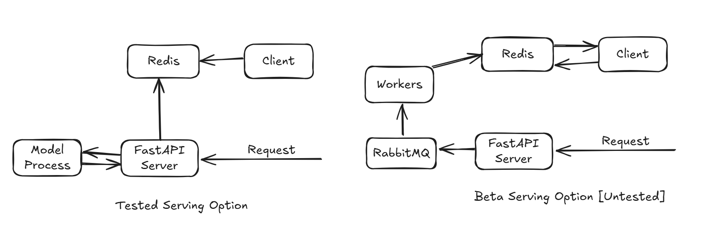


# Online Evaluation
## Closing the feedback Loop
- To close the feedback loop, we opted for explicit user interaction
- We created a rudimentary HTML page where we can enter a user_id and it gives out the recommended playlist_id
- The user chooses which playlist they like
    - The liked interaction along with the ignored playlist is then sent to the Postgres database based for next iteration of model retraining
- For the sample client_app, see the [link](https://github.com/AguLeon/MLOps_G47_SpotifyBuddies/tree/main/client_app_sample)
- (Very rudimentary) UI
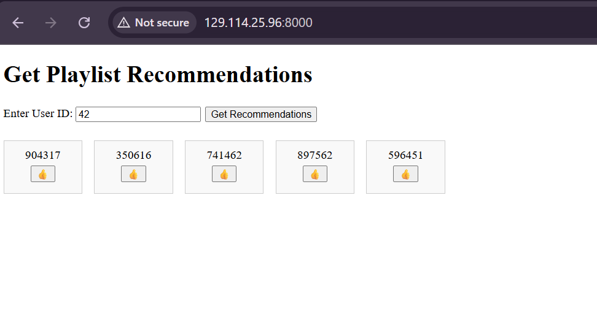

# Monitoring
- We used Grafana with Prometheus as data source to monitor the "online" environment
- We made 2 dashboards:
    - API monitoring
        - Here, we monitor: API latency, Average API request rate, API fail rate
    - Model monitoring
        - Here, we monitor: Total Number of inference, Total Number of Cold User Encountered, Inference time, and the distribution of predictions over time

## Data Drift-detection
- During testing phase, we found out that the most prominent issues our model could face was the cold-user (i.e. user's without prior playlists/music test). So, we focused on detection of cold-start user
- For this, we simply counted the rate of fraction of cold users we encountered. This can be seen in the dashboards below
    - This simple drift detection worked for our current use case.
    - With the increase of data size and features, we can move away from this and use more advance detection technique such as Chi-Square test
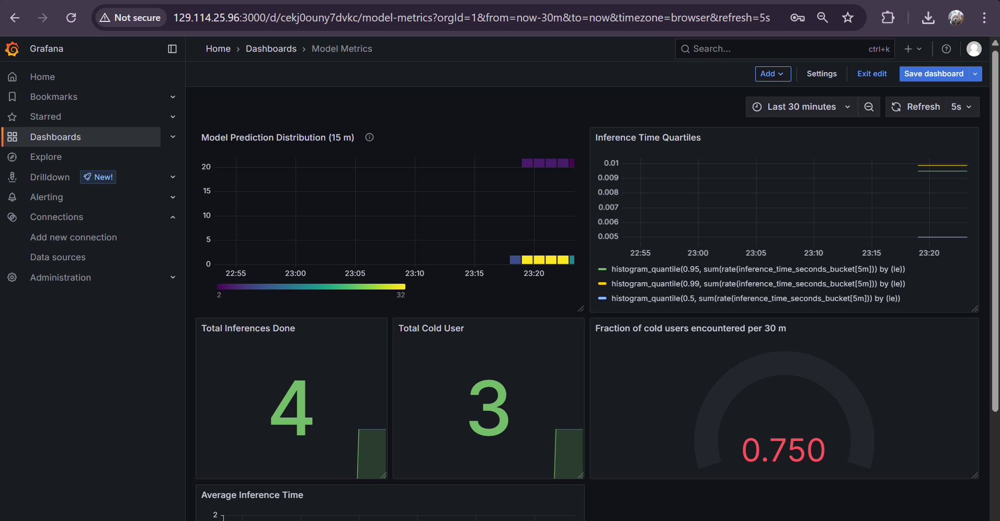

# Data pipeline (Akhil)

## Persistent Storage

### Object Store in CHI@TACC

`object-persist-project47`
`~7GB used`
[see on chi@tacc](https://chi.tacc.chameleoncloud.org/project/containers/container/object-persist-project47)

Contains:

1. **triplets_data** - Contains the PyTorch tensor file containing training data
2. **val_eval_batches** - For evaluation
3. **positives_splits**
4. **user_pairing_model**
5. **other_utils**

### Block Store in KVM@TACC

`block-persist-project47`
`Size 50GB allocated`
[see on kvm@tacc](https://kvm.tacc.chameleoncloud.org/project/volumes/42b1865a-6ff9-44ed-9f8d-8ca639f4b97c/)

Contains data for:

1. **Postgres**(used for storing feedback data, Metabase dashboard metadata, Grafana and Prometheus related data)
2. **Grafana**
3. **Prometheus**
4. **MinIO**

**Scripts for persistent storage setup**

- [Provision object store on Chameleon](./provision_object_storage.sh)
- [Provision block store on Chameleon](./provision_block_storage.sh)
- [Setup object store on the instance](./setup_object_store.sh)
- [Setup block store on the instance](./setup_block_store.sh)

## Offline data and Data Pipeline

Covered below in detail.


## Data Dashboard

We use a Metabase dashboard to monitor various metrics related to both the data and its quality.

For the training data, we display key metrics such as the number of distinct users and the average number of user-blocks per user.
A `user-block` is defined as a triplet: `(user_id, playlist_id_positive, playlist_id_negative_list)`. Each user-block groups together entries by user_id and their preferred `playlist_id_positive`, along with a list of `playlist_id_negative` values. These negative playlist IDs represent alternatives that the user preferred less than the positive one.
To ensure the integrity and consistency of our training data, we validate that each `user-block` contains only one `playlist_id_positive` per `(user_id, playlist_id_positive)` combination.

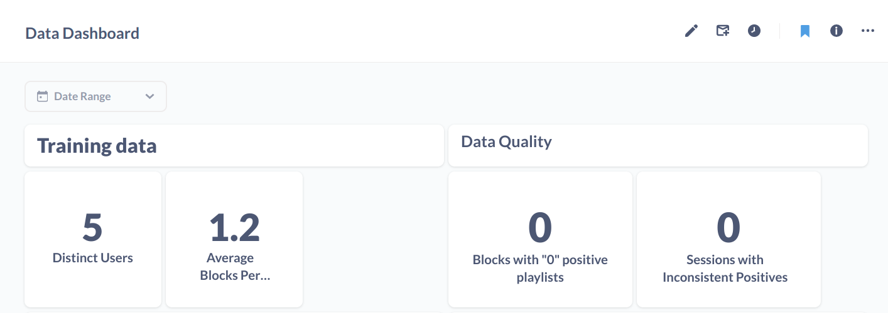

For feedback data, we track metrics such as:

- Daily and weekly user counts providing feedback
- Average feedback score per day, to identify potential recommendation bias
- Invalid user-blocks, similar to training data checks, to ensure data integrity
- Feedback volume over time, which helps determine when enough new data has accumulated to trigger model retraining
- Cumulative feedback growth, providing insight into overall dataset expansion
- Number of distinct feedback users, which helps us monitor user diversity and avoid over-representation by "power users"

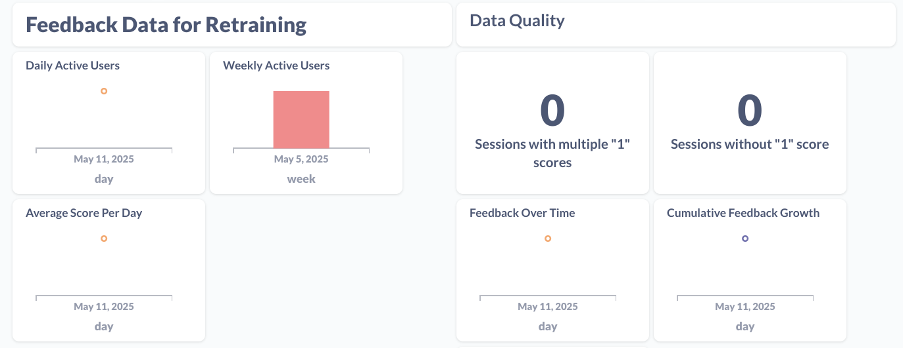

## Online Data

[Airflow script for user simulation](./../model_monitoring/dags/pipeline_2_inference.py)

User interaction with the recommendation system is simulated using an **Airflow script**. This script utilizes the **test data split** stored in an object store and runs as a scheduled job every **10 minutes**. In each run, it randomly selects a subset of users and invokes the FastAPI `/recommend` endpoint over a 10-minute window to fetch playlist recommendations. Each API call returns **5 playlist recommendations** for a given user.

To **close the feedback loop**, we collect user responses through a hosted UI. Currently, the interface allows the user to **like one playlist out of the five recommended**. For simulation purposes, this interaction is automated— the Airflow script also makes calls to the FastAPI `/feedback` endpoint, mimicking user input. The simulated feedback is then stored in a **PostgreSQL database**, ensuring we can track and analyze user preferences over time.

The request and response format as given below:

**/recommend API**

Request

```
curl -X 'POST' \
  'http://<url>/api/playlist/recommend/' \
  -H 'accept: application/json' \
  -H 'Content-Type: application/json' \
  -d '{
  "user_ids": [
    22434
  ]
}'
```

Response

```
[
  {
    "user_id": 22434,
    "playlists": [
      14546, 28783, 209745, 29747, 32649
    ]
  }
]
```

**/feedback API**

Request

```
curl -X 'POST' \
  'http://<url>/feedback' \
  -H 'accept: application/json' \
  -H 'Content-Type: application/json' \
  -d '{
  "user_id": 22434,
  "like_playlist": 28783,
  "other_playlists": [
    14546, 209745, 29747, 32649
  ]
}'
```

Response

```
{
  "msg": "Feedback Sent"
}
```

## Data for Retraining

[Airflow script to extract feedback data for retraining](./../model_monitoring/dags/pipeline_extract_prod_data.py)

The **user feedback data stored in PostgreSQL** is extracted on a weekly basis using a separate Airflow script. This script processes the data by splitting it into **training, validation, and test sets**, and converts it into the appropriate format required for retraining the model.

To store the processed data, the script uses the rclone tool (invoked via Python subprocesses) to upload the new datasets to the **object store**. This newly collected data is then appended to the existing training dataset.

In recommendation systems, it's common to adopt a **sliding window approach** for training data. As we accumulate more feedback, older data is gradually phased out to keep the dataset manageable in size and relevant. This is especially important in our context—since user preferences tend to evolve, recent behavior (e.g., from the past month) is generally more indicative of current interests than data that is several months or a year old.


# Data Preprocessing

## General overview

The data preprocessing was one of they key procedures for our project, and one of the tasks that took the longest toll on our time. The main reason is that we had to take the Million Playlist Dataset (MPD) and Echo-Nest Taste Profile dataset (ENTP) and merge them together, simulating what playlists (MPD) each user (ENTP) likes.

Additionally, the datasets were quite large. MPD itself is about 30GB and ENTP about 3GB. MPD has about 1 million playlists with about 2 million different songs. ENTP has 1 million users and about 380k songs. The song overlap between both datasets is 120k songs.

Midway through preprocessing we decided to resize the data, and we kept working only with 10% of users. The full-sized dataset was too large to work with, required to batch every single operation, frequently crashed and debugging was very difficult. Since the data was very large, we were able to afford downsizing and still have a good training process. More details given below.

---

---

## Part 1) Raw data and initial processing

- We load raw data both from ENTP and MPD. Nothing is done here to MPD data, apart from putting the raw slices in a directory.
- For ENTP data, raw data only has song_id’s, but no song names or artist names. This info is supposed to be fetched from the Million Song Dataset (different from MPD): [http://millionsongdataset.com/](http://millionsongdataset.com/). We grab that information and create a new ENTP dataset with that information included.

---

---

## Part 2) Processing MPD and ENTP and create unique song_ids shared between the two datasets

- As mentioned there are about 120k songs shared among MPD and ENTP. In this step we generate unique song id’s that are shared between MPD and ENTP.

---

---

## Part 3) Compute the overlap between users and playlists based on songs: use of sparse matrices (scipy.sparse)

- Goal: we need to assess for each user and playlist, how many songs of the playlist exist in the user song collection. We are looking for a shape like the one in the table below:

| user_id | playlist_id | song matches |
| --- | --- | --- |
| 42 | 123 | 10 |
| 42 | 423 | 35 |
| 107 | 123 | 0 |
| 107 | 423 | 24 |
- Initially we started to compute this iteratively, but the estimated time to complete the calculation was about a week, so we decided to use sparse matrices instead.
- For the sparse matrices, we create first a user_song matrix and also a playlist_song matrix. The user_song matrix looks something like the table below, where 1 indicates the user has that song in its library. The same is done for playlists.

| user_id/song_id | 1 | 2 | 3 | 4 | 5 |
| --- | --- | --- | --- | --- | --- |
| 1 | 0 | 1 | 1 | 1 | 0 |
| 2 | 0 | 0 | 0 | 0 | 0 |
| 3 | 1 | 0 | 1 | 0 | 1 |
| 4 | 1 | 0 | 1 | 1 | 1 |
| 5 | 1 | 1 | 0 | 1 | 0 |
- Then, we take the dot product between both matrices. Both matrices are huge, therefore we batch the multiplication per slices. The final result looks like the table below:

| user_id/playlist_id | 1 | 2 | 3 | 4 | 5 |
| --- | --- | --- | --- | --- | --- |
| 1 | 12 | 1 | 5 | 25 | 51 |
| 2 | 0 | 0 | 1 | 2 | 3 |
| 3 | 12 | 2 | 5 | 25 | 51 |
| 4 | 62 | 4 | 5 | 42 | 24 |
| 5 | 131 | 3 | 5 | 24 | 8 |
- Finally we grab this huge matrix and reshape it in a more friendly shape like the table below:

| user_id | playlist_id | song_matches |
| --- | --- | --- |
| 1 | 1 | 12 |
| 1 | 2 | 1 |
| 1 | 3 | 5 |
| 2 | 1 | 0 |
| 2 | 2 | 1 |

## Part 3.5) Getting the song count per user and song count per playlist (will be required for Part 4):

- Here we just compute the size of the song library of each user, and the amount of songs in each playlist and store it in a file. We will need this for Part 4.

---

---

## Part 4) Calculate scores per user-playlist pairs

- For each user-playlist pair we need a score of how much the user ‘likes’ the given playlist. This scores will then be used to create the true labels for training. Basically each user will have ‘liked’ playlists, that they would like if they are given as a recommendation.
- Our scoring function is of course based on song similarity between the user song library and the playlist songs list. However, we added some more complexity to it, captured in an ‘exploration coefficient’ for each user. This coefficient goes from 0 to 1 and measures ‘how explorative’ each user is. A user with exploration_coefficient = 0 wants playlists that are perfectly aligned with their current song library, a user with exploration_coefficient=1 values only playlists that have no overlap with their current song library.
- Additionally, the scores are normalized both by user song library size and by playlist song size.

The score between a user \( i \) and a playlist \( j \) is computed as:

$$
\text{Score}_{ij} = \frac{(1 - e) \cdot \log(1 + m) + e}{\sqrt{s} \times \sqrt{p}}
$$

Where:
m = number of song matches between user i and playlist j
e = exploration coefficient for user i (random between 0 and 1, skewed towards lower values using a Beta distribution)
s = total number of unique songs in user i's library
p = total number of unique songs in playlist j

Higher scores indicate playlists better aligned to the user's taste.
The e term adds randomness and encourages exploration.
We normalize by s and p to avoid favoring users or playlists with large libraries.

- For the exploration coefficient, we sampled values from a beta distribution. The graph below shows it’s distribution. The assumption is the following: most users want to explore a little bit, and don’t want playlists 100% aligned with their current song library. Also, a few users are very explorative, but the distribution falls quickly as the exploration coefficient increases.


- We are also including some statistics about the exploration coefficient: s

```
📊

Exploration Coefficient Statistics:
Min: 0.0000
P1: 0.0096
P25: 0.1287
Median: 0.2496
Mean: 0.2827
P75: 0.4064
P99: 0.7835
Max: 0.9900

```

- Finally, we compute the scores for all user-playlist pairs. The min score sits between 0.0013 and 0.0016, the max score is around 0.49, and the medians core is around 0.125.

---
---

## Part 5) Rank playlists per user and tag ‘liked’ playlists

- For each user we will take the top 1.5% playlists by score and mark them as ‘liked’ by the user.
- Some statistics for the amount of liked playlists per user below (this is for just one slice of 10,000 users). We can see that the median is about 200 songs liked per user, which is reasonable if we think about an average person and the potential set of playlists they might like.

```
📊

Statistics of liked playlists per user, for a slice of users:
Total users: 9,984
Total rows: 223,192,860
Positive (liked) playlists: 3,352,842 (1.50%)
Negative (non-liked) playlists: 219,840,018 (98.50%)
Average playlists liked per user: 335.82
Median playlists liked per user: 199.00
Min playlists liked per user: 1.00
Max playlists liked per user: 4,339.00

```


---

---

## Part 6) Start preparing the splits of data: new_users (cold users), and then train, validation, and test splits. Also assign playlist ownership among users.

- This section has 4 sub-steps:
1. Downscale the dataset to 10%. Every operation was taking too long and the dataset was too massive. We sample here 10% of users and continue only with them.
2. Split the data
    1. First, we will separate from the data 5% of users, with all of their playlist information. This will be kept aside as cold users for post-deployment tasks.
    2. Next, we split the liked playlists per user into training, validation and test sets. This is to resemble the ‘past and future’ nature of recommender systems. We will train the model on user-playlist interactions we have seen so far, but for evaluation, we will ask the model to rank at the top a playlist that we know the user should like, but that the model hasn’t seen as a positive for that user yet. We do a 70%-20%-10% split between train-val-test sets, among the positive playlists (”liked” playlists).

---

---

## Part 7) Assign Playlist Ownership

1. Assign playlist ownership
    1. We will assign playlist ownership in principle to the user that has the highest score for that playlist. However, we will also normalize by the user’s song library size, to avoid assigning a playlist to a user only because their song library is huge (’generalist user’).
    2. We will calculate then a ‘priority score’ as below:
$$
\text{priority} = \frac{\text{score}}{\sqrt{\text{user's song count}}}
$$
    4. Validation positives are excluded from ownership assignment for a given user.
    5. We also impose a maximum amount of playlists owned by a single user to 100 playlists.
    6. The algorithm iterates over playlists and looks into the highest scoring users for that playlist. It guarantees that every single playlist will be owned by one and only one user.
    7. Let’s explore some statistics about playlist ownership below. We see that on average users own 4.6 playlists, with a median of 2 playlists. We also explore some ‘ inequality’ metrics: 1% of users own 15% of playlists, and 25% own 72% of playlists. We believe this is quite realistic, as in music streaming services not all users are heavy producers of their own playlists, and some users are ‘power users’  that create many playlists. Of course these are mere assumptions.
    
    ```
    📊
    
    Playlist Ownership Stats (Global):
    
    - Users with ownership: 39,653
    - Min owned : 1
    - Max owned : 100
    - Average owned : 4.57
    - Median owned : 2.0
    - 25th percentile : 1.0
    - 75th percentile : 4.0
    ```
    
    
    
    ```
    📊
    
    Playlist Ownership Inequality Stats:
     - Top 1% own 15.34% of playlists
     - Top 5% own 37.29% of playlists
     - Top 10% own 50.83% of playlists
     - Top 25% own 71.68% of playlists
     - Gini coefficient       : 0.6033
    
    ```
    
    
    
    ---
    
    ---
    
    ## Part 8) Generate triplets training dataset!
    
    - Bayesian Personalized Ranking (BPR) models are typically trained using triplets that express a **relative user preference**.
    - Each triplet has the form: `(user_id, positive_playlist_id, negative_playlist_id)`.
    - We use the training split of positive playlists, and for each of them, we generate **4 negatives**.
    - Negative playlists are drawn from a precomputed pool of candidates:
        - **Top 20% (by score)** are considered **hard negatives**—they were close to being positives and help the model learn to distinguish fine-grained preferences.
        - The remaining 80% are **easy negatives**.
    - For each positive, we sample:
        - Half the negatives from the **hard pool**, and
        - The other half from the **easy pool**.
    - We avoid including playlists that were **owned or already positively labeled**, ensuring clean contrastive signals.
    - The script also creates a **toy dataset** for 5% of users to support fast debugging and experimentation.
    - Finally we shuffle and save the file in torch format.
    - Below we can see some statistics about the triplets. On average, each user has 942 triplets, with a median of 576.
    
    ```
    📊
    
    Stats for one slice of triplets:
    
    - Users in slice : 945
    - Total triplets : 890,860
    - Mean : 942.71
    - Min : 4
    - Max : 10532
    - P1 : 4.00
    - P25 : 152.00
    - P50 (Median) : 576.00
    - P75 : 1248.00
    - P99 : 6686.72
    ```
    
    
    

---

---

## Part 9) Generate validation batches

- We will do our BPR model evaluation during training in a customized way (that is standard for recommendation models).
- We will pack 1 unseen positive for a given user with 50 negative playlists, and we will measure how often and how high does the model rank the positive playlist.
- We will use two types of metrics:

    - **Hit@K:**
        
        Measures the percentage of times the positive playlist appears in the top K ranked results. It answers the question: *"Did we get the right answer in the top K?"*
        
    - **MRR (Mean Reciprocal Rank)**
        
        Measures the average of the reciprocal ranks of the true positive in the ranked list. A higher MRR means the model is ranking positives closer to the top.
        
$$
\text{MRR} = \frac{1}{N} \sum_{i=1}^{N} \frac{1}{\text{rank}_i}
$$
        

- Therefore, we need to prepare validation batches for each user. 1 unseen positive packed with 50 negatives. Negatives can’t be playlists that were positives in training.
- For a given user, we will have both unseen and seen negatives (seen negatives = negatives that were negatives for that user in training).
- The validation positives are unseen for a given user, but they might have been a positive for a different user during training.


# Part 4: Continuous X (Jishnu)

Below is the folder structure for the continuous_x_pipeline code

```text
├── continuous_x_pipeline
│   ├── ansible
│   │   ├── argocd
│   │   ├── k8s
│   │   │   ├── inventory
│   │   │   │   └── mycluster
│   │   │   │       └── group_vars
│   │   │   └── kubespray
│   │   ├── post_k8s
│   │   └── pre_k8s
│   ├── k8s
│   │   ├── canary
│   │   │   └── templates
│   │   ├── monitoring
│   │   │   ├── airflow
│   │   │   ├── grafana
│   │   │   ├── prometheus
│   │   │   └── redis
│   │   ├── platform
│   │   │   ├── fastapi
│   │   │   └── templates
│   │   ├── production
│   │   │   └── templates
│   │   └── staging
│   │       └── templates
│   ├── terraform
│   └── workflows
```


--------

## Infrastructure-as-Code (IaC) - Terraform

We manage all of our Chameleon infrastructure with Terraform. The entire configuration lives in the ```/continuous_x_pipeline/terraform``` folder of the repository.

In [versions.tf](https://github.com/AguLeon/MLOps_G47_SpotifyBuddies/tree/main/continuous_x_pipeline/terraform/versions.tf/) -
We lock our Terraform toolchain to version 0.14 or newer, and pin the OpenStack provider plugin to the 1.51.x series to guarantee reproducability across machines.

In [provider.tf](https://github.com/AguLeon/MLOps_G47_SpotifyBuddies/tree/main/continuous_x_pipeline/terraform/provider.tf/) -
We declare a single OpenStack provider named "openstack", matching the cloud entry in your clouds.yaml. Terraform will read your Chameleon credentials from that file and use them for all API calls.

### Input Variables
In [variables.tf](https://github.com/AguLeon/MLOps_G47_SpotifyBuddies/tree/main/continuous_x_pipeline/terraform/variables.tf/) - 
We expose four key variables:

suffix (string, required) – our project’s unique suffix (project47 in our case), appended to every resource name to avoid collisions.

key (string, default id_rsa_chameleon) – the SSH keypair name to install on each VM.

nodes (map of strings) – a map of logical node names ("node1", "node2", "node3") to fixed private IP addresses on our 192.168.1.0/24 subnet and they are named node1-mlops-project47, node2-mlops-project47, node3-mlops-project47.

data_volume_size (default 50) – the size (in GB) of a shared block-storage volume we attach to node1 for logs, model artifacts, or other persistent files.

### Data Sources
In [data.tf](https://github.com/AguLeon/MLOps_G47_SpotifyBuddies/tree/main/continuous_x_pipeline/terraform/data.tf/) - 
We import existing OpenStack objects we do not manage in this repo:

The public network & subnet (sharednet2), so we can place VM ports there.

Seven security groups (allow-ssh, allow-9001, allow-8000, allow-8080, allow-8081, allow-http-80, and allow-9090) to lock down SSH and our various service ports.

### Core Resources
[main.tf](https://github.com/AguLeon/MLOps_G47_SpotifyBuddies/tree/main/continuous_x_pipeline/terraform/main.tf/):

Private Network & Subnet
We create a new isolated network and a 192.168.1.0/24 subnet with port security disabled. This hosts our control-plane communication between nodes.

Network Ports
For each node in var.nodes, we use up two ports:

-A private port on our new subnet, taking the IP from the map.

-A public port on sharednet2, bound to exactly the security groups we imported.

Compute Instances
We launch one Ubuntu VM per entry in var.nodes (flavor m1.medium). Each VM gets both its private and public port attached, plus a little user_data script to populate /etc/hosts and install your SSH keys via the Chameleon cloud-init hook.

Floating IP
We allocate a single floating IP and bind it to node1’s public port—this is the IP you’ll use to reach your cluster head node for Ansible, ArgoCD, or your FastAPI endpoints.

Persistent Block Storage
We create a volume of size var.data_volume_size (50 GB) and attach it to node1 at /dev/vdb, giving you a durable filesystem for model artifacts, data, or logs.

### Outputs
[outputs.tf](https://github.com/AguLeon/MLOps_G47_SpotifyBuddies/tree/main/continuous_x_pipeline/terraform/outputs.tf/) - 
We export only the floating IP’s address as floating_ip_out. This makes it easy for subsequent Ansible playbooks or for your README instructions to reference exactly terraform output floating_ip_out when building your inventory or service URLs.


The ```ansible/inventory.yml``` file has the IP’s of the 3 nodes provisioned using Terraform.


## Instructions to run terraform:

1. Open a Jupyter server on chameleon.
2. Upload your clouds.yaml file in the server.
3. Clone the github repo - 

`git clone --recurse-submodules https://github.com/AguLeon/MLOps_G47_SpotifyBuddies.git`

1. Go to KVM@TACC in chameleon > Identity > Application Credential > Create an application credential on Chameleon and download the clouds.yaml file.
2. Upload your clouds.yaml file to jupyter. (It should be stored in /work/clouds.yaml)
3. Open terminal and run the following commands:
    1. `cd /work/MLOps_G47_SpotifyBuddies/continuous_x_pipeline/terraform` #Navigating to the directory
    2. `chmod +x terraform_script.sh` #To make the script executable 
    3. `./terraform_script.sh` #Run the script

----

## Configuration-as-Code (CaC) & Kubernetes Bootstrapping

All cluster provisioning and application registration is fully automated with Ansible, under the continuous_x_pipeline/ansible directory. 


1. **OS Preparation**
    - **Playbook:** [pre_k8s_configure](https://github.com/AguLeon/MLOps_G47_SpotifyBuddies/tree/main/continuous_x_pipeline/ansible/pre_k8s/pre_k8s_configure.yml)
        
        Runs on all nodes to disable and mask firewalld, install containerd (or Docker), and configure /etc/docker/daemon.json with our insecure-registry settings. This ensures our cluster nodes will pull images from the local registry without manual steps.
        
2. **Kubernetes Installation (done using Kubespray)**
    - **Inventory:**
        - [hosts.yaml](https://github.com/AguLeon/MLOps_G47_SpotifyBuddies/tree/main/continuous_x_pipeline/ansible/k8s/inventory/mycluster/hosts.yaml)  - lists each node’s private IP and SSH user.
        - [all.yaml](https://github.com/AguLeon/MLOps_G47_SpotifyBuddies/tree/main/continuous_x_pipeline/ansible/k8s/inventory/mycluster/group_vars/all.yaml) -  overrides defaults to enable the dashboard, Helm, and disable features we don’t need (VIP, Node Feature Discovery).
    - **Run:**  ```ansible-playbook -i ansible/k8s/inventory/mycluster/ansible.cfg ansible/k8s/kubespray/cluster.yml```
        
        This playbook deploys a self-managed Kubernetes cluster across the three VMs, handling kube-adm, networking, and control-plane HA out-of-the-box.

        The code for running the ansible playbook to create the k8s configuration is in 
[Ansible-k8s](https://github.com/AguLeon/MLOps_G47_SpotifyBuddies/tree/main/continuous_x_pipeline/ansible.ipynb). Create a jupyter notebook in chameleon and run this jupyter notebook after adding ansible.cfg

    
    [nodes-on-k8s](./continuous_x_pipeline/images/nodes_on_kubernetes.png)
        
3. **Post-Install Configuration**
    - **Playbook:** [post_k8s_configure](https://github.com/AguLeon/MLOps_G47_SpotifyBuddies/tree/main/continuous_x_pipeline/ansible/post_k8s/post_k8s_configure.yml)
        
        On node1, copies the cluster’s `admin.conf` into each user’s `~/.kube/config`, sets up hostname mappings, and applies sysctl tweaks (e.g. disabling IPv6). This gives you immediate `kubectl` access via the head node.

----

## Applications:

The applications we are using are:<br>
Graphana - dashboard and visualization tool for monitoring metrics and logs.

Prometheus - Real-time monitoring by scraping FastAPI server in 15 second intervals

Minio - Storing MLflow artifacts and MLflow tracking using a bucket

Airflow - To schedule inference as well as simulating the users interacting with recommendation.

Redis - Stores the model 

Postgres - To store the feedback, and used by other applications.

MLFlow - Tracking experiments, storing model metrics and model registration.

FastAPI - Model serving


----

## List of namespaces:

I've created a total of 5 namespaces for our application.

### [`spotifybuddies-platform`](https://github.com/AguLeon/MLOps_G47_SpotifyBuddies/tree/main/continuous_x_pipeline/k8s/platform)  
**Purpose:** Core platform services that support experiment tracking, model registry, and artifact storage.  
**Contains:**  
- PostgreSQL
- MinIO
- MLflow Server
- FastAPI


---

### [`spotifybuddies-monitoring`](https://github.com/AguLeon/MLOps_G47_SpotifyBuddies/tree/main/continuous_x_pipeline/k8s/monitoring)
**Purpose:** Cluster-wide monitoring and visualization.  

**Contains:**  
- Prometheus   
- Grafana 
- Airflow  
- Redis 

---

### [`spotifybuddies-staging`](https://github.com/AguLeon/MLOps_G47_SpotifyBuddies/tree/main/continuous_x_pipeline/k8s/staging)
**Purpose:** Early testing environment for our FastAPI application before canary rollout.  

**Contains:**  spotifybuddies-app Deployment 

---

### [`spotifybuddies-canary`](https://github.com/AguLeon/MLOps_G47_SpotifyBuddies/tree/main/continuous_x_pipeline/k8s/canary)  
**Purpose:** Gradual roll-out environment to validate new image tags under real traffic.  

**Contains:** spotifybuddies-app Deployment  

---

### [`spotifybuddies-production`](https://github.com/AguLeon/MLOps_G47_SpotifyBuddies/tree/main/continuous_x_pipeline/k8s/production)

**Purpose:** Live environment serving real user traffic.  

**Contains:** spotifybuddies-app Deployment   

----

The jupyter notebook for adding environments, platforms and build.
[Ansible-platform & build](https://github.com/AguLeon/MLOps_G47_SpotifyBuddies/tree/main/continuous_x_pipeline/ansible_build.ipynb)

The command ```ansible-playbook -i inventory.yml argocd/argocd_add_platform.yml``` was run to add platforms, after which all the applications could be accessed.
For example, MLFlow can be accessed using - [Link](http://129.114.25.50:8000/)

## Error Description

After completion of the kubernetes deployment using Ansible, I ran into running the ansible-playbook -i inventory.yml argocd/workflow_build_init.yml


This triggered an Argo Workflow with two steps: a git-clone to fetch the repository and a Kaniko container build.

While the Git clone step successfully cloned the repository into /mnt/workspace (as confirmed by the following output):

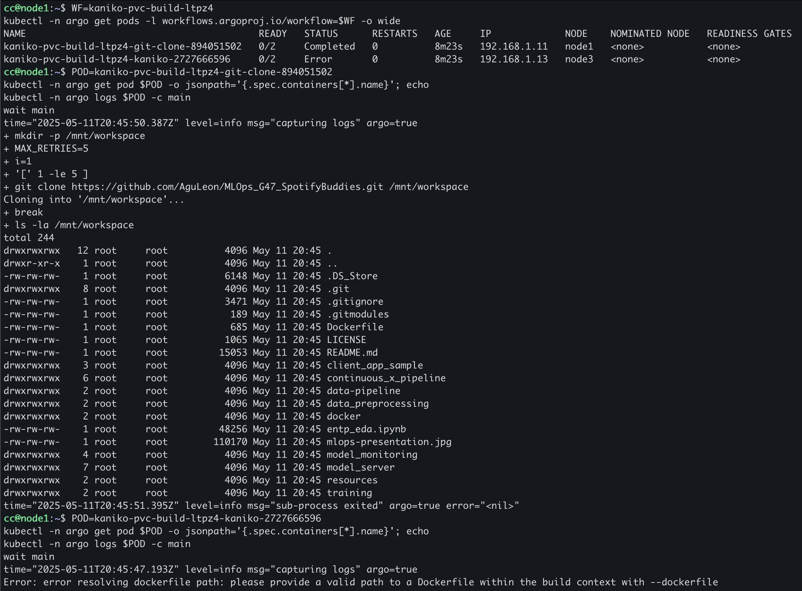

the subsequent Kaniko step failed with the following error: error resolving dockerfile path: please provide a valid path to a Dockerfile within the build context with --dockerfile

As seen in the output of the ls command the Dockerfile is in the root directory itself. 
The error was during the execution of the file [build-initial.yaml](https://github.com/AguLeon/MLOps_G47_SpotifyBuddies/tree/main/continuous_x_pipeline/workflows/build-initial.yaml) in line 56 despite trying with both absolute, and relative path.

```- --dockerfile=/mnt/workspace/Dockerfile```

```- --dockerfile=Dockerfile```

---

While the Kubernetes infrastructure and ArgoCD integration were successfully set up, all three application environments—staging, canary, and production—failed during runtime due to missing container images. This is the reason that although the ansible notebook ran for each of the 3 environments, the deployment wasn't successful. 


As seen in the ArgoCD UI screenshot, the spotifybuddies-staging, spotifybuddies-canary, and spotifybuddies-production applications are in a "Degraded" state. Correspondingly, the kubectl get pods output confirms that each environment's FastAPI deployment pod is stuck in the ImagePullBackOff state, which indicates Kubernetes is continuously attempting, and failing, to pull the required container image.


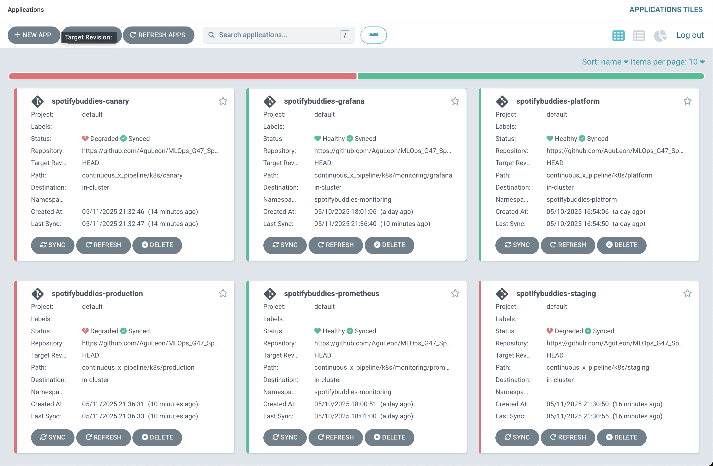


