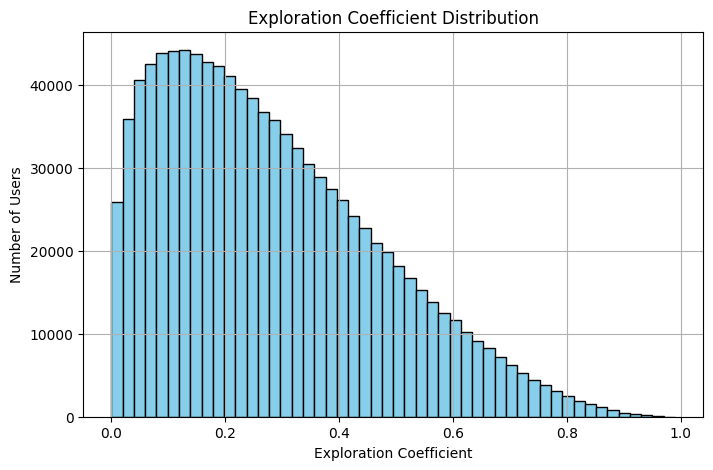
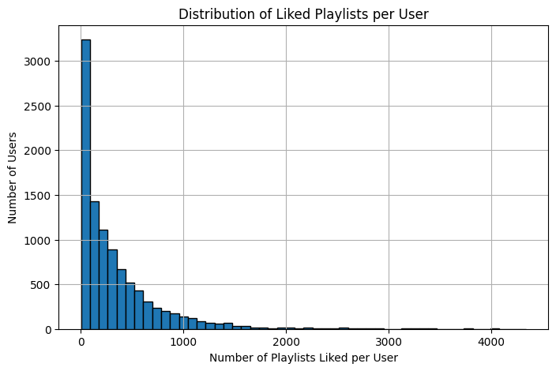
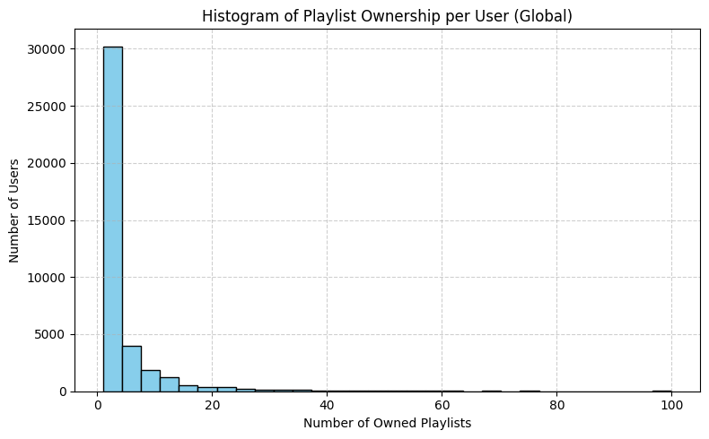
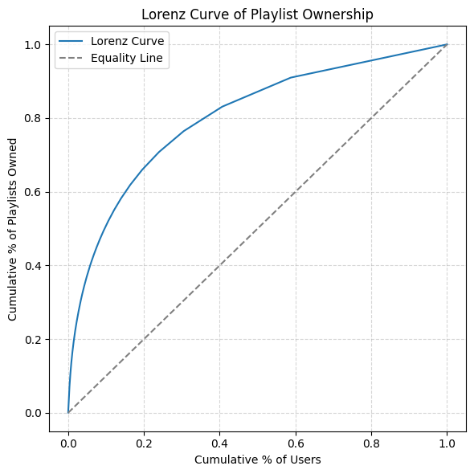
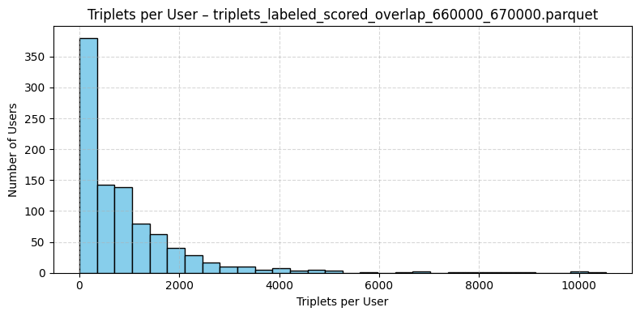

# Data Preprocessing README

## General overview

The data preprocessing was one of they key procedures for our project, and one of the tasks that took the longest toll on our time. The main reason is that we had to take the Million Playlist Dataset (MPD) and Echo-Nest Taste Profile dataset (ENTP) and merge them together, simulating what playlists (MPD) each user (ENTP) likes.

Additionally, the datasets were quite large. MPD itself is about 30GB and ENTP about 3GB. MPD has about 1 million playlists with about 2 million different songs. ENTP has 1 million users and about 380k songs. The song overlap between both datasets is 120k songs.

Midway through preprocessing we decided to resize the data, and we kept working only with 10% of users. The full-sized dataset was too large to work with, required to batch every single operation, frequently crashed and debugging was very difficult. Since the data was very large, we were able to afford downsizing and still have a good training process. More details given below.

---

---

## Part 1) Raw data and initial processing

- We load raw data both from ENTP and MPD. Nothing is done here to MPD data, apart from putting the raw slices in a directory.
- For ENTP data, raw data only has song_id’s, but no song names or artist names. This info is supposed to be fetched from the Million Song Dataset (different from MPD): [http://millionsongdataset.com/](http://millionsongdataset.com/). We grab that information and create a new ENTP dataset with that information included.

---

---

## Part 2) Processing MPD and ENTP and create unique song_ids shared between the two datasets

- As mentioned there are about 120k songs shared among MPD and ENTP. In this step we generate unique song id’s that are shared between MPD and ENTP.

---

---

## Part 3) Compute the overlap between users and playlists based on songs: use of sparse matrices (scipy.sparse)

- Goal: we need to assess for each user and playlist, how many songs of the playlist exist in the user song collection. We are looking for a shape like the one in the table below:

| user_id | playlist_id | song matches |
| --- | --- | --- |
| 42 | 123 | 10 |
| 42 | 423 | 35 |
| 107 | 123 | 0 |
| 107 | 423 | 24 |
- Initially we started to compute this iteratively, but the estimated time to complete the calculation was about a week, so we decided to use sparse matrices instead.
- For the sparse matrices, we create first a user_song matrix and also a playlist_song matrix. The user_song matrix looks something like the table below, where 1 indicates the user has that song in its library. The same is done for playlists.

| user_id/song_id | 1 | 2 | 3 | 4 | 5 |
| --- | --- | --- | --- | --- | --- |
| 1 | 0 | 1 | 1 | 1 | 0 |
| 2 | 0 | 0 | 0 | 0 | 0 |
| 3 | 1 | 0 | 1 | 0 | 1 |
| 4 | 1 | 0 | 1 | 1 | 1 |
| 5 | 1 | 1 | 0 | 1 | 0 |
- Then, we take the dot product between both matrices. Both matrices are huge, therefore we batch the multiplication per slices. The final result looks like the table below:

| user_id/playlist_id | 1 | 2 | 3 | 4 | 5 |
| --- | --- | --- | --- | --- | --- |
| 1 | 12 | 1 | 5 | 25 | 51 |
| 2 | 0 | 0 | 1 | 2 | 3 |
| 3 | 12 | 2 | 5 | 25 | 51 |
| 4 | 62 | 4 | 5 | 42 | 24 |
| 5 | 131 | 3 | 5 | 24 | 8 |
- Finally we grab this huge matrix and reshape it in a more friendly shape like the table below:

| user_id | playlist_id | song_matches |
| --- | --- | --- |
| 1 | 1 | 12 |
| 1 | 2 | 1 |
| 1 | 3 | 5 |
| 2 | 1 | 0 |
| 2 | 2 | 1 |

## Part 3.5) Getting the song count per user and song count per playlist (will be required for Part 4):

- Here we just compute the size of the song library of each user, and the amount of songs in each playlist and store it in a file. We will need this for Part 4.

---

---

## Part 4) Calculate scores per user-playlist pairs

- For each user-playlist pair we need a score of how much the user ‘likes’ the given playlist. This scores will then be used to create the true labels for training. Basically each user will have ‘liked’ playlists, that they would like if they are given as a recommendation.
- Our scoring function is of course based on song similarity between the user song library and the playlist songs list. However, we added some more complexity to it, captured in an ‘exploration coefficient’ for each user. This coefficient goes from 0 to 1 and measures ‘how explorative’ each user is. A user with exploration_coefficient = 0 wants playlists that are perfectly aligned with their current song library, a user with exploration_coefficient=1 values only playlists that have no overlap with their current song library.
- Additionally, the scores are normalized both by user song library size and by playlist song size.

The score between a user \( i \) and a playlist \( j \) is computed as:

$$
\text{Score}_{ij} = \frac{(1 - e) \cdot \log(1 + m) + e}{\sqrt{s} \times \sqrt{p}}
$$

Where:
m = number of song matches between user i and playlist j
e = exploration coefficient for user i (random between 0 and 1, skewed towards lower values using a Beta distribution)
s = total number of unique songs in user i's library
p = total number of unique songs in playlist j

Higher scores indicate playlists better aligned to the user's taste.
The e term adds randomness and encourages exploration.
We normalize by s and p to avoid favoring users or playlists with large libraries.

- For the exploration coefficient, we sampled values from a beta distribution. The graph below shows it’s distribution. The assumption is the following: most users want to explore a little bit, and don’t want playlists 100% aligned with their current song library. Also, a few users are very explorative, but the distribution falls quickly as the exploration coefficient increases.




- We are also including some statistics about the exploration coefficient: s

```
📊

Exploration Coefficient Statistics:
Min: 0.0000
P1: 0.0096
P25: 0.1287
Median: 0.2496
Mean: 0.2827
P75: 0.4064
P99: 0.7835
Max: 0.9900

```

- Finally, we compute the scores for all user-playlist pairs. The min score sits between 0.0013 and 0.0016, the max score is around 0.49, and the medians core is around 0.125.

---

---

## Part 5) Rank playlists per user and tag ‘liked’ playlists

- For each user we will take the top 1.5% playlists by score and mark them as ‘liked’ by the user.
- Some statistics for the amount of liked playlists per user below (this is for just one slice of 10,000 users). We can see that the median is about 200 songs liked per user, which is reasonable if we think about an average person and the potential set of playlists they might like.

<aside>
📊

Statistics of liked playlists per user, for a slice of users:
Total users: 9,984
Total rows: 223,192,860
Positive (liked) playlists: 3,352,842 (1.50%)
Negative (non-liked) playlists: 219,840,018 (98.50%)
Average playlists liked per user: 335.82
Median playlists liked per user: 199.00
Min playlists liked per user: 1.00
Max playlists liked per user: 4,339.00

</aside>



---

---

## Part 6) Start preparing the splits of data: new_users (cold users), and then train, validation, and test splits. Also assign playlist ownership among users.

- This section has 4 sub-steps:
1. Downscale the dataset to 10%. Every operation was taking too long and the dataset was too massive. We sample here 10% of users and continue only with them.
2. Split the data
    1. First, we will separate from the data 5% of users, with all of their playlist information. This will be kept aside as cold users for post-deployment tasks.
    2. Next, we split the liked playlists per user into training, validation and test sets. This is to resemble the ‘past and future’ nature of recommender systems. We will train the model on user-playlist interactions we have seen so far, but for evaluation, we will ask the model to rank at the top a playlist that we know the user should like, but that the model hasn’t seen as a positive for that user yet. We do a 70%-20%-10% split between train-val-test sets, among the positive playlists (”liked” playlists).

---

---

## Part 7) Assign Playlist Ownership

1. Assign playlist ownership
    1. We will assign playlist ownership in principle to the user that has the highest score for that playlist. However, we will also normalize by the user’s song library size, to avoid assigning a playlist to a user only because their song library is huge (’generalist user’).
    2. We will calculate then a ‘priority score’ as below:
    $$
    \text{priority} = \frac{\text{score}}{\sqrt{\text{user's song count}}}
    $$
    4. Validation positives are excluded from ownership assignment for a given user.
    5. We also impose a maximum amount of playlists owned by a single user to 100 playlists.
    6. The algorithm iterates over playlists and looks into the highest scoring users for that playlist. It guarantees that every single playlist will be owned by one and only one user.
    7. Let’s explore some statistics about playlist ownership below. We see that on average users own 4.6 playlists, with a median of 2 playlists. We also explore some ‘ inequality’ metrics: 1% of users own 15% of playlists, and 25% own 72% of playlists. We believe this is quite realistic, as in music streaming services not all users are heavy producers of their own playlists, and some users are ‘power users’  that create many playlists. Of course these are mere assumptions.
    
    <aside>
    📊
    
    Playlist Ownership Stats (Global):
    
    - Users with ownership: 39,653
    - Min owned : 1
    - Max owned : 100
    - Average owned : 4.57
    - Median owned : 2.0
    - 25th percentile : 1.0
    - 75th percentile : 4.0
    </aside>
    
    
    
    <aside>
    📊
    
    Playlist Ownership Inequality Stats:
     - Top 1% own 15.34% of playlists
     - Top 5% own 37.29% of playlists
     - Top 10% own 50.83% of playlists
     - Top 25% own 71.68% of playlists
     - Gini coefficient       : 0.6033
    
    </aside>
    
    
    
    ---
    
    ---
    
    ## Part 8) Generate triplets training dataset!
    
    - Bayesian Personalized Ranking (BPR) models are typically trained using triplets that express a **relative user preference**.
    - Each triplet has the form: `(user_id, positive_playlist_id, negative_playlist_id)`.
    - We use the training split of positive playlists, and for each of them, we generate **4 negatives**.
    - Negative playlists are drawn from a precomputed pool of candidates:
        - **Top 20% (by score)** are considered **hard negatives**—they were close to being positives and help the model learn to distinguish fine-grained preferences.
        - The remaining 80% are **easy negatives**.
    - For each positive, we sample:
        - Half the negatives from the **hard pool**, and
        - The other half from the **easy pool**.
    - We avoid including playlists that were **owned or already positively labeled**, ensuring clean contrastive signals.
    - The script also creates a **toy dataset** for 5% of users to support fast debugging and experimentation.
    - Finally we shuffle and save the file in torch format.
    - Below we can see some statistics about the triplets. On average, each user has 942 triplets, with a median of 576.
    
    <aside>
    📊
    
    Stats for one slice of triplets:
    
    - Users in slice : 945
    - Total triplets : 890,860
    - Mean : 942.71
    - Min : 4
    - Max : 10532
    - P1 : 4.00
    - P25 : 152.00
    - P50 (Median) : 576.00
    - P75 : 1248.00
    - P99 : 6686.72
    </aside>
    
    
    

---

---

## Part 9) Generate validation batches

- We will do our BPR model evaluation during training in a customized way (that is standard for recommendation models).
- We will pack 1 unseen positive for a given user with 50 negative playlists, and we will measure how often and how high does the model rank the positive playlist.
- We will use two types of metrics:
    - **MRR (Mean Reciprocal Rank)**
        
        Measures the average of the reciprocal ranks of the true positive in the ranked list. A higher MRR means the model is ranking positives closer to the top.
        
        $$
        \text{MRR} = \frac{1}{N} \sum_{i=1}^{N} \frac{1}{\text{rank}_i}
        $$
        
    - **Hit@K:**
        
        Measures the percentage of times the positive playlist appears in the top K ranked results. It answers the question: *"Did we get the right answer in the top K?"*
        
- Therefore, we need to prepare validation batches for each user. 1 unseen positive packed with 50 negatives. Negatives can’t be playlists that were positives in training.
- For a given user, we will have both unseen and seen negatives (seen negatives = negatives that were negatives for that user in training).
- The validation positives are unseen for a given user, but they might have been a positive for a different user during training.